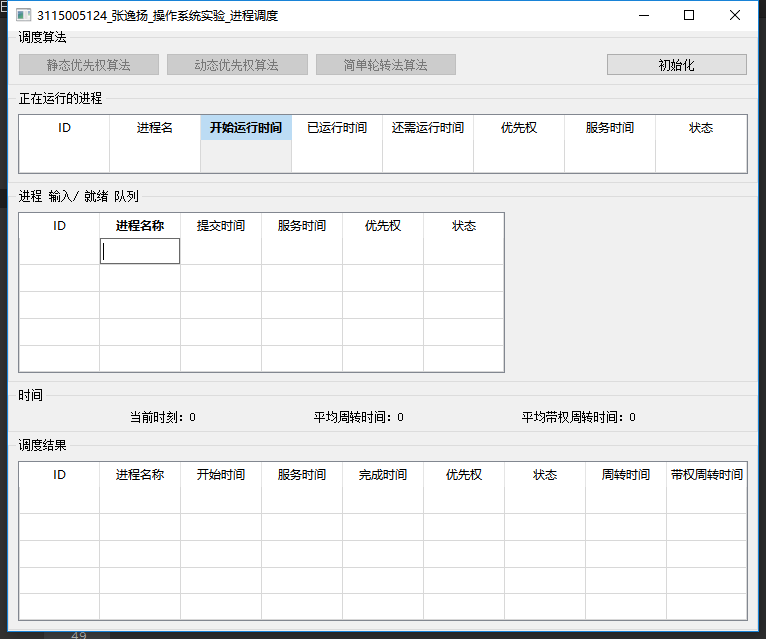
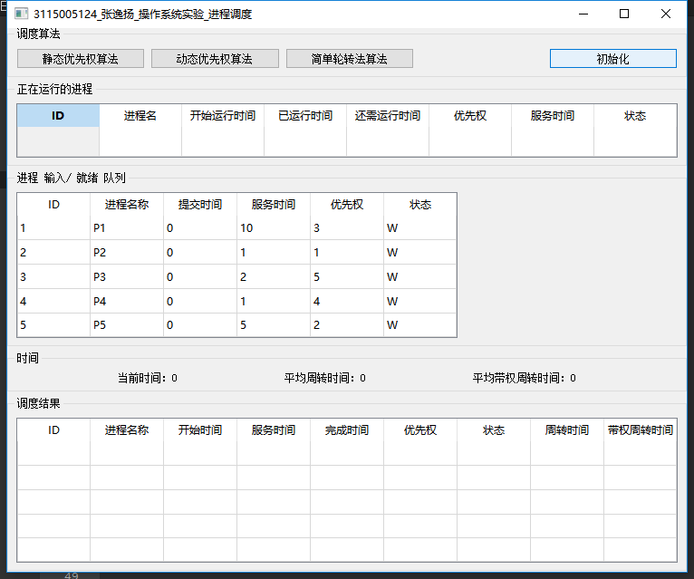
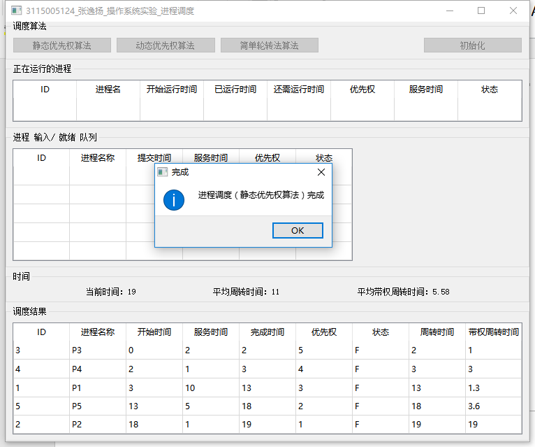
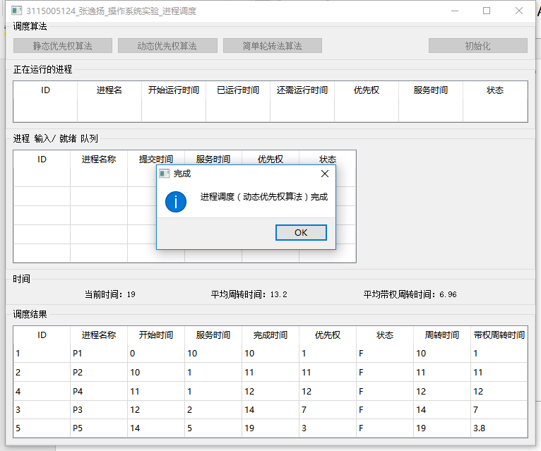
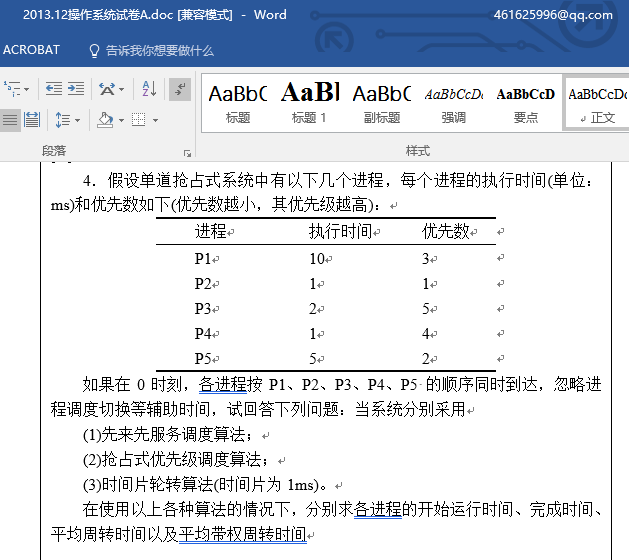
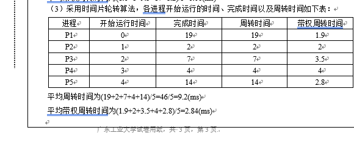
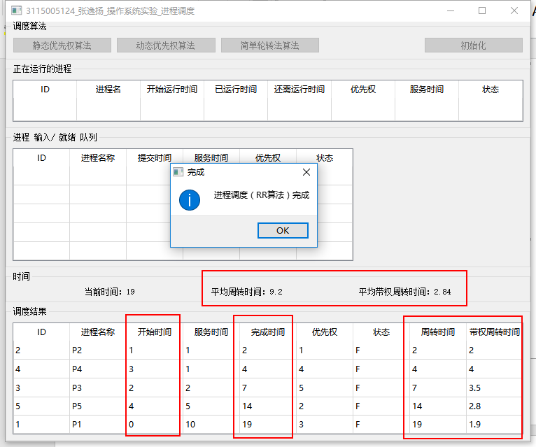

# OS_Exp_process

「操作系统」实验一：进程调度

## 1 实验目的

用高级语言编写和调试一个进程调度程序，以加深对进程的概念及进程调度算法的理解。

## 2 实验内容
1． 编写并调试一个模拟的进程调度程序，采用“最高优先数优先”调度算法对五个进程进行调度。

    “最高优先数优先”调度算法的基本思想是把CPU分配给就绪队列中优先数最高的进程。

    静态优先数是在创建进程时确定的，并在整个进程运行期间不再改变。

    动态优先数是指进程的优先数在创建进程时可以给定一个初始值，并且可以按一定原则修改优先数。例如：在进程获得一次CPU后就将其优先数减少1。或者，进程等待的时间超过某一时限时增加其优先数的值，等等。

2． 编写并调试一个模拟的进程调度程序，采用“轮转法”调度算法对五个进程进行调度。

    轮转法可以是简单轮转法、可变时间片轮转法，或多队列轮转法。

    简单轮转法的基本思想是：所有就绪进程按FCFS排成一个队列，总是把处理机分配给队首的进程，各进程占用CPU的时间片相同。如果运行进程用完它的时间片后还为完成，就把它送回到就绪队列的末尾，把处理机重新分配给队首的进程。直至所有的进程运行完毕。

## 3 实验运行截图

▲程序主界面，此时可选择“初始化”。“正在运行的进程”表格 与 “调度结果”表格 不可选中编辑。“进程 输入/输出 队列”表格 可以选中编辑。

▲点击“初始化”按钮，会显示一组 预输入数据。可以自由修改。

▲静态优先权算法 运行结果。

注意：此处 约定 优先权越大 优先权越高！

▲动态优先权算法 运行结果。

注意：此处 约定 优先权越大 优先权越高。

此处 动态优先权计算方式：

动态优先权 = （等待时间 + 要求服务时间） / 要求服务时间

▲对于“时间片轮转算法”，此处选择 广东工业大学2013.12操作系统考试的一道计算题来验证。

▲广东工业大学2013.12操作系统考试的一道计算题 时间片轮转算法 的答案部分。

▲时间片轮转算法 调度结果，如图。经比对，结果正确。

## 4 关键代码

略。